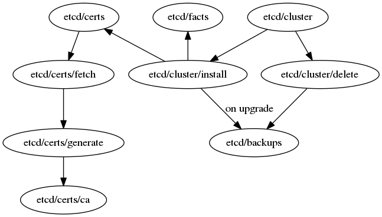

# etcd-ansible

Deploy and manage production-grade etcd clusters with automated certificate management using Smallstep CA.

## Features

- ✅ **Automated Certificate Management** - Smallstep CA with automatic renewal
- ✅ **High Availability** - Multi-node support with automated CA key replication
- ✅ **Secure by Default** - 2-year certificates, private keys never transmitted
- ✅ **Zero-Downtime Operations** - Rolling upgrades and certificate renewal
- ✅ **Disaster Recovery** - AWS KMS encrypted backups with automated restore
- ✅ **Production Ready** - Industry-standard PKI with best practices

## Requirements

- Ansible 2.9+
- Python 3.6+
- Target nodes: Ubuntu 20.04+, Debian 11+, RHEL 8+, or CoreOS
- AWS CLI (for S3 backups and KMS encryption)

## Quick Start

### 1. Setup AWS KMS Key for CA Backups (One-time)

Create AWS KMS key for encrypting CA backups:

```bash
# Create KMS key
aws kms create-key \
  --description "Encryption key for etcd CA backups" \
  --tags TagKey=Purpose,TagValue=etcd-ca-backup

# Note the KeyId from output, then create alias
aws kms create-alias \
  --alias-name alias/etcd-ca-backup \
  --target-key-id <KEY_ID_FROM_ABOVE>

# Grant permissions to your etcd nodes IAM role
aws kms put-key-policy \
  --key-id alias/etcd-ca-backup \
  --policy-name default \
  --policy file://kms-policy.json
```

Create `kms-policy.json`:
```json
{
  "Version": "2012-10-17",
  "Statement": [
    {
      "Sid": "Enable IAM User Permissions",
      "Effect": "Allow",
      "Principal": {
        "AWS": "arn:aws:iam::YOUR_ACCOUNT_ID:root"
      },
      "Action": "kms:*",
      "Resource": "*"
    },
    {
      "Sid": "Allow etcd nodes to use key",
      "Effect": "Allow",
      "Principal": {
        "AWS": "arn:aws:iam::YOUR_ACCOUNT_ID:role/etcd-nodes-role"
      },
      "Action": [
        "kms:Encrypt",
        "kms:Decrypt",
        "kms:DescribeKey",
        "kms:GenerateDataKey"
      ],
      "Resource": "*"
    }
  ]
}
```

**Or use the automated playbook:**
```bash
ansible-playbook -i localhost, playbooks/setup-kms.yaml -e kms_key_alias=alias/etcd-ca-backup
```

### 2. Create Inventory

Create an inventory with the following groups:
- `[etcd]`: List of etcd cluster nodes
- `[etcd-clients]`: Nodes that need client certificates to connect to etcd
- `[etcd-cert-managers]`: Nodes that run step-ca (usually first etcd node + backups)

```bash
cp inventory-example.ini inventory.ini
```

Example inventory:
```ini
[etcd]
etcd-k8s-1 ansible_host=10.0.1.10
etcd-k8s-2 ansible_host=10.0.1.11
etcd-k8s-3 ansible_host=10.0.1.12

[etcd-clients]
kube-apiserver-1 ansible_host=10.0.2.10
kube-apiserver-2 ansible_host=10.0.2.11

[etcd-cert-managers]
etcd-k8s-1  # Primary cert-manager (runs step-ca)
etcd-k8s-2  # Backup cert-manager (CA keys replicated)
```

### 3. Configure Secrets

Create encrypted vault file for sensitive variables:

```bash
# Copy example vault file
cp group_vars/all/vault.yml.example group_vars/all/vault.yml

# Edit with your values
vi group_vars/all/vault.yml

# Encrypt with ansible-vault
ansible-vault encrypt group_vars/all/vault.yml
```

Required secrets in `group_vars/all/vault.yml`:
```yaml
# Smallstep CA passwords
step_ca_password: "your-secure-ca-password"
step_provisioner_password: "your-secure-provisioner-password"

# AWS S3 bucket for CA backups
step_ca_backup_s3_bucket: "your-org-etcd-backups"

# AWS S3 bucket for etcd data backups
etcd_upload_backup:
  storage: s3
  bucket: "your-org-etcd-backups"

# KMS key for encryption
step_ca_backup_kms_key_id: "alias/etcd-ca-backup"
```

### 4. Deploy etcd Cluster

```bash
# Deploy cluster with Smallstep CA
ansible-playbook -i inventory.ini etcd.yaml \
  -e etcd_action=create \
  --vault-password-file ~/.vault-pass \
  -b --become-user=root
```

This will:
1. Install step-ca on cert-manager node (etcd-k8s-1)
2. Initialize CA with root and intermediate certificates
3. Install step CLI on all nodes
4. Generate certificates for all nodes (2-year lifetime)
5. Configure automatic renewal via systemd timers
6. Deploy and start etcd cluster
7. Replicate CA keys to backup cert-managers

### 5. Verify Installation

```bash
# Check cluster health
ansible etcd -i inventory.ini -m shell -a "systemctl status etcd-*" -b

# Check step-ca status
ansible etcd-cert-managers -i inventory.ini -m shell -a "systemctl status step-ca" -b

# Check certificate details
ansible etcd -i inventory.ini -m shell -a "step certificate inspect /etc/etcd/ssl/etcd-*-peer.crt | grep -E '(Subject|Not After)'" -b

# Verify etcd cluster
ansible etcd[0] -i inventory.ini -m shell -a "
  etcdctl --endpoints=https://10.0.1.10:2379,https://10.0.1.11:2379,https://10.0.1.12:2379 \
  --cert=/etc/etcd/ssl/etcd-k8s-1-client.crt \
  --key=/etc/etcd/ssl/etcd-k8s-1-client.key \
  --cacert=/etc/etcd/ssl/root_ca.crt \
  endpoint health
" -b
```

## Architecture

### Role Structure

```
roles/etcd3/
├── cluster/           # Etcd cluster lifecycle management
│   ├── install/       # Deploy and configure etcd nodes
│   └── delete/        # Remove etcd cluster
├── certs/             # Certificate management
│   └── smallstep/     # Smallstep CA integration (default)
├── facts/             # Populate etcd cluster facts for other roles
├── backups/           # Snapshot creation and S3 upload
└── download/          # Binary downloads (etcd, step-ca, step-cli)
```

### Certificate Architecture (Smallstep CA)

```
┌─────────────────────────────────────────────────────┐
│ etcd-k8s-1 (Cert-Manager)                           │
│ - etcd cluster member                               │
│ - step-ca service (port 9000)                       │
│ - CA keys in /etc/step-ca/secrets/                  │
└─────────────────────────────────────────────────────┘
                    │
                    │ HTTPS
                    │ Certificate requests
        ┌───────────┼───────────┐
        ▼           ▼           ▼
    ┌────────┐  ┌────────┐  ┌─────────┐
    │ etcd-2 │  │ etcd-3 │  │ clients │
    │ step   │  │ step   │  │ step    │
    │ CLI    │  │ CLI    │  │ CLI     │
    └────────┘  └────────┘  └─────────┘
```

**Key Features:**
- Private keys generated on each node (never transmitted)
- Automatic certificate renewal via systemd timers
- 2-year certificate lifetime (configurable)
- Zero-downtime certificate rotation
- HA support with CA key replication

See [CERTIFICATE_ARCHITECTURE.md](CERTIFICATE_ARCHITECTURE.md) for detailed documentation.



## Cluster Management

### Actions

Cluster operations are controlled via the `etcd_action` variable:

| Action | Description | Usage |
|--------|-------------|-------|
| `create` | Deploy new cluster | First-time installation |
| `deploy` | Deploy or update | Same as create but for existing clusters |
| `upgrade` | Upgrade etcd version | Bump etcd version with rolling restart |
| `backup` | Create snapshot | Manual backup trigger |

### Install New Cluster

Deploy a new cluster (first time only):

```bash
ansible-playbook -i inventory.ini etcd.yaml \
  -e etcd_action=create \
  --vault-password-file ~/.vault-pass \
  -b --become-user=root
```

**What happens:**
1. Installs step-ca on cert-manager nodes
2. Initializes CA with root and intermediate certificates
3. Replicates CA keys to backup cert-managers (if configured)
4. Installs step CLI on all nodes
5. Generates certificates (2-year lifetime)
6. Configures automatic renewal
7. Deploys etcd cluster
8. Verifies cluster health

**Systemd service naming:** `etcd-{{cluster_name}}-{{index}}`

Example:
```bash
# Check status
systemctl status etcd-default-1

# View logs
journalctl -u etcd-default-1 -f
```

### Recover from Installation Failures

If installation fails partway through:

```bash
# Retry with force flag
ansible-playbook -i inventory.ini etcd.yaml \
  -e etcd_action=create \
  -e etcd_force_create=true \
  --vault-password-file ~/.vault-pass \
  -b --become-user=root
```

### Upgrade Cluster

Upgrade etcd version with rolling restart:

```bash
ansible-playbook -i inventory.ini etcd.yaml \
  -e etcd_action=upgrade \
  -e etcd_version=v3.5.26 \
  --vault-password-file ~/.vault-pass \
  -b --become-user=root
```

**Safety features:**
- Automatic backup before upgrade
- Health check before proceeding
- One node at a time (serial: 1)
- Verifies cluster health after each node

### Delete Cluster

**WARNING:** This removes all data and certificates!

```bash
ansible-playbook -i inventory.ini etcd.yaml \
  -e etcd_delete_cluster=true \
  -b --become-user=root
```

You will be prompted to confirm deletion.

### Add New Node to Existing Cluster

1. Add node to inventory:
```ini
[etcd]
etcd-k8s-1
etcd-k8s-2
etcd-k8s-3
etcd-k8s-4  # NEW
```

2. Deploy to new node only:
```bash
ansible-playbook -i inventory.ini etcd.yaml \
  -e etcd_action=create \
  --limit=etcd-k8s-4 \
  --vault-password-file ~/.vault-pass \
  -b --become-user=root
```

The new node will automatically:
- Request certificates from existing step-ca
- Configure automatic renewal
- Join the cluster

## Certificate Management (Smallstep CA)

### Overview

This project uses **Smallstep CA (step-ca)** for automated certificate management. This provides:

- **Automatic Issuance**: Nodes request certificates directly from step-ca
- **Automatic Renewal**: Systemd timers renew at 2/3 of certificate lifetime
- **Zero Downtime**: Certificates renewed without restarting etcd
- **Modern Security**: Industry-standard PKI, private keys never leave nodes
- **Easy Scaling**: New nodes automatically get certificates

### Certificate Lifecycle

| Certificate | Lifetime | Renewal | Location |
|-------------|----------|---------|----------|
| Root CA | 10 years | Manual | `/etc/step-ca/certs/root_ca.crt` |
| Intermediate CA | 10 years | Manual | `/etc/step-ca/secrets/intermediate_ca_key` |
| Node Certificates | 2 years | Automatic (~487 days) | `/etc/etcd/ssl/etcd-*-{peer,server,client}.crt` |

### How It Works

1. **step-ca runs on cert-manager node** (typically first etcd node)
2. **Each node requests certificates** using `step ca certificate` command
3. **Private keys generated locally** on each node during request
4. **Certificates signed remotely** by step-ca and returned to node
5. **Systemd timers** automatically renew certificates before expiration
6. **Zero-downtime reload** of etcd after certificate renewal

### Certificate Locations

```
/etc/etcd/ssl/
├── etcd-k8s-1-peer.crt         # Peer certificate (public)
├── etcd-k8s-1-peer.key         # Peer private key (0400)
├── etcd-k8s-1-server.crt       # Server certificate (public)
├── etcd-k8s-1-server.key       # Server private key (0400)
├── etcd-k8s-1-client.crt       # Client certificate (public)
├── etcd-k8s-1-client.key       # Client private key (0400)
├── root_ca.crt                 # Root CA (public)
├── peer-ca.crt → root_ca.crt   # Symlink for compatibility
└── client-ca.crt → root_ca.crt # Symlink for compatibility
```

### Manual Certificate Operations

```bash
# Check certificate expiration
step certificate inspect /etc/etcd/ssl/etcd-k8s-1-peer.crt

# Force certificate renewal
systemctl start step-renew-etcd-k8s-1-peer.service

# Check renewal timer status
systemctl list-timers 'step-renew-*'

# View renewal logs
journalctl -u step-renew-etcd-k8s-1-peer.service
```

### Security Model

**Private Keys:**
- ✅ Generated on each node locally
- ✅ Never transmitted over network
- ✅ Permissions: 0400 (read-only by owner)
- ✅ Owner: etcd user

**CA Keys:**
- ✅ Stored only on cert-manager nodes
- ✅ Backed up encrypted to S3 (AWS KMS)
- ✅ Replicated to backup cert-managers
- ✅ Permissions: 0400 (read-only by root)

**Communication:**
- ✅ All certificate requests over HTTPS
- ✅ Only public data transmitted (signed certificates)
- ✅ step-ca validates all requests before signing

See [CERTIFICATE_ARCHITECTURE.md](CERTIFICATE_ARCHITECTURE.md) for detailed security documentation.

## Backup and Disaster Recovery

### Automated Backups

Automated backups are configured during cluster deployment. Two types of backups run automatically:

**1. CA Backups (Change-based)**
- Checks CA files every 5 minutes for changes
- Only backs up when CA keys/config changes
- Uploads encrypted backup to S3 with KMS
- Keeps latest backup always available

**2. Etcd Data Backups (Time-based)**
- Runs every 30 minutes (configurable)
- Creates encrypted snapshot of cluster data
- Uploads to S3 with KMS encryption
- Automatic retention cleanup (90 days default)

**Configuration variables:**
```yaml
# In group_vars/all/vault.yml or inventory
etcd_backup_cron_enabled: true
etcd_backup_interval: "*/30"  # Every 30 minutes

ca_backup_cron_enabled: true
ca_backup_check_interval: "*/5"  # Check every 5 minutes

# Optional: Deadman monitoring (get alerted if backup stops working)
backup_healthcheck_enabled: true
backup_healthcheck_url: "https://hc-ping.com/your-uuid"
ca_backup_healthcheck_url: "https://hc-ping.com/your-ca-uuid"

# Retention
etcd_backup_retention_days: 90
ca_backup_retention_days: 365
```

**View backup logs:**
```bash
# CA backups
tail -f /var/log/etcd-backups/ca-backup.log

# Etcd data backups
tail -f /var/log/etcd-backups/etcd-backup.log
```

**Disable automated backups:**
```yaml
# In inventory or group_vars
etcd_backup_cron_enabled: false
ca_backup_cron_enabled: false
```

### Automated etcd Data Backups

```bash
# Create snapshot backup
ansible-playbook -i inventory.ini etcd.yaml \
  -e etcd_action=backup \
  --vault-password-file ~/.vault-pass \
  -b --become-user=root
```

Snapshots are stored in:
- Local: `{{ etcd_home }}/backups/{{ etcd_cluster_name }}/YYYY/MM/snapshot.db`
- S3: `s3://{{ bucket }}/{{ etcd_cluster_name }}/YYYY/MM/snapshot.db` (if configured)

### Disaster Recovery

#### Scenario 1: Primary Cert-Manager Fails

**RTO:** 5-10 minutes

```bash
# Activate step-ca on backup node
ssh etcd-k8s-2
systemctl start step-ca

# Verify
curl -k https://etcd-k8s-2:9000/health
```

#### Scenario 2: Restore CA from Backup

**RTO:** 10-30 minutes

```bash
# From another cert-manager node
ansible-playbook -i inventory.ini playbooks/restore-ca.yaml \
  -e source_node=etcd-k8s-2 \
  -e target_node=etcd-k8s-1

# From S3 encrypted backup
ansible-playbook -i inventory.ini playbooks/restore-ca-from-backup.yaml \
  -e target_node=etcd-k8s-1 \
  --vault-password-file ~/.vault-pass
```

#### Scenario 3: Restore etcd Data

**Using Ansible playbook (recommended):**
```bash
# Restore from latest S3 backup
ansible-playbook -i inventory.ini playbooks/restore-etcd-cluster.yaml

# Restore from specific backup
ansible-playbook -i inventory.ini playbooks/restore-etcd-cluster.yaml \
  -e restore_etcd_s3_file="etcd-cluster/2026/01/etcd-default-2026-01-20_14-30-00-snapshot.db.kms"

# Restore from local file
ansible-playbook -i inventory.ini playbooks/restore-etcd-cluster.yaml \
  -e restore_etcd_local_file="/var/lib/etcd/backups/etcd-default-snapshot.db"

# Skip confirmation prompt
ansible-playbook -i inventory.ini playbooks/restore-etcd-cluster.yaml \
  -e restore_confirm=false
```

**Manual restore process:**
```bash
# List available backups
aws s3 ls s3://etcd-backups/etcd-default/ --recursive

# Download and decrypt
aws s3 cp s3://etcd-backups/etcd-default/latest-snapshot.db.kms /tmp/
aws kms decrypt --ciphertext-blob fileb:///tmp/latest-snapshot.db.kms \
  --output text --query Plaintext | base64 -d > /tmp/restore.db

# Stop etcd, restore, restart
systemctl stop etcd-default-1
mv {{ etcd_data_dir }} {{ etcd_data_dir }}.backup
etcdutl snapshot restore /tmp/restore.db --data-dir {{ etcd_data_dir }}
chown -R etcd:etcd {{ etcd_data_dir }}
systemctl start etcd-default-1
```

See [CERTIFICATE_ARCHITECTURE.md](CERTIFICATE_ARCHITECTURE.md) for detailed DR procedures.

## Configuration

### Essential Variables

All user-configurable variables are in `roles/etcd3/defaults/main.yaml` and `roles/etcd3/certs/smallstep/defaults/main.yml`.

**Cluster Configuration** (`roles/etcd3/defaults/main.yaml`):
```yaml
# Cluster identity
etcd_cluster_name: default
etcd_version: v3.5.26

# Ports
etcd_ports:
  client: 2379
  peer: 2380

# Paths
bin_dir: /opt/bin
etcd_home: /var/lib/etcd/
etcd_config_dir: /etc/etcd
etcd_cert_dir: /etc/etcd/ssl

# Performance tuning
etcd_heartbeat_interval: 250
etcd_election_timeout: 5000
etcd_snapshot_count: 10000
etcd_compaction_retention: "8"

# Backups
etcd_backup: yes  # Auto-backup before upgrade/delete
```

**Certificate Configuration** (`roles/etcd3/certs/smallstep/defaults/main.yml`):
```yaml
# step-ca configuration
step_ca_port: 9000
step_ca_provisioner: "etcd-provisioner"

# Certificate lifetimes
step_cert_default_duration: "17520h"  # 2 years
step_cert_max_duration: "26280h"      # 3 years
step_cert_min_duration: "1h"

# Backup configuration
step_ca_backup_encryption_method: "aws-kms"
step_ca_backup_kms_key_id: "alias/etcd-ca-backup"
step_ca_backup_s3_bucket: "etcd-backups"
```

### Sensitive Variables (ansible-vault)

Store in `group_vars/all/vault.yml` (encrypted):
```yaml
step_ca_password: "secure-password"
step_provisioner_password: "secure-password"
step_ca_backup_password: "backup-password"  # If using symmetric encryption
```

### Inventory Groups

Required groups:
- `[etcd]`: Etcd cluster member nodes
- `[etcd-clients]`: Nodes needing client certificates
- `[etcd-cert-managers]`: Nodes running step-ca (primary + backups)

### Example Configurations

**Small cluster (3 nodes):**
```ini
[etcd]
etcd-1 ansible_host=10.0.1.10
etcd-2 ansible_host=10.0.1.11
etcd-3 ansible_host=10.0.1.12

[etcd-cert-managers]
etcd-1  # Single cert-manager
```

**HA cluster with backup cert-managers:**
```ini
[etcd]
etcd-1 ansible_host=10.0.1.10
etcd-2 ansible_host=10.0.1.11
etcd-3 ansible_host=10.0.1.12

[etcd-cert-managers]
etcd-1  # Primary - step-ca running
etcd-2  # Backup - CA keys replicated, step-ca stopped
```

**With client nodes:**
```ini
[etcd]
etcd-1 ansible_host=10.0.1.10
etcd-2 ansible_host=10.0.1.11
etcd-3 ansible_host=10.0.1.12

[etcd-clients]
kube-apiserver-1 ansible_host=10.0.2.10
kube-apiserver-2 ansible_host=10.0.2.11

[etcd-cert-managers]
etcd-1
```

## Integration with Other Systems

### Kubernetes API Server

Use the `etcd3/facts` role to populate connection variables:

```yaml
- hosts: kube-master
  roles:
    - etcd3/facts
  tasks:
    - name: Configure kube-apiserver
      template:
        src: kube-apiserver.yaml.j2
        dest: /etc/kubernetes/manifests/kube-apiserver.yaml
```

Available facts:
- `etcd_access_addresses`: Comma-separated etcd endpoints
- `etcd_cert_paths.client.cert`: Path to client certificate
- `etcd_cert_paths.client.key`: Path to client private key
- `etcd_cert_paths.client.ca`: Path to CA certificate
- `etcd_members`: Dict with details about each etcd node

Example template:
```yaml
# kube-apiserver.yaml.j2
spec:
  containers:
  - name: kube-apiserver
    command:
    - kube-apiserver
    - --etcd-servers={{ etcd_access_addresses }}
    - --etcd-cafile={{ etcd_cert_paths.client.ca }}
    - --etcd-certfile={{ etcd_cert_paths.client.cert }}
    - --etcd-keyfile={{ etcd_cert_paths.client.key }}
```

## Monitoring and Health Checks

### Cluster Health

```bash
# Check all endpoints
etcdctl --endpoints=https://etcd-k8s-1:2379,https://etcd-k8s-2:2379,https://etcd-k8s-3:2379 \
  --cert=/etc/etcd/ssl/etcd-k8s-1-client.crt \
  --key=/etc/etcd/ssl/etcd-k8s-1-client.key \
  --cacert=/etc/etcd/ssl/root_ca.crt \
  endpoint health

# Check cluster members
etcdctl member list

# Check database size
etcdctl endpoint status --write-out=table
```

### Certificate Health

```bash
# Check certificate expiration
ansible etcd -i inventory.ini -m shell -a \
  "step certificate inspect /etc/etcd/ssl/etcd-*-peer.crt | grep 'Not After'" -b

# Check renewal timer status
ansible etcd -i inventory.ini -m shell -a \
  "systemctl list-timers 'step-renew-*'" -b

# Check step-ca health
curl -k https://etcd-k8s-1:9000/health
```

### Systemd Service Status

```bash
# All etcd services
ansible etcd -i inventory.ini -m shell -a "systemctl status 'etcd-*'" -b

# step-ca service
ansible etcd-cert-managers -i inventory.ini -m shell -a "systemctl status step-ca" -b

# Renewal timers
ansible etcd -i inventory.ini -m shell -a "systemctl status 'step-renew-*.timer'" -b
```

## Troubleshooting

### step-ca Won't Start

```bash
# Check logs
journalctl -u step-ca -n 100

# Verify CA files exist
ls -la /etc/step-ca/secrets/

# Verify permissions
stat -c '%a %U' /etc/step-ca/secrets/root_ca_key
# Should be: 400 root

# Test configuration
/opt/bin/step-ca --dry-run /etc/step-ca/config/ca.json
```

### Certificate Request Fails

```bash
# Test connectivity to step-ca
curl -k https://etcd-k8s-1:9000/health

# Test certificate request
step ca certificate test /tmp/test.crt /tmp/test.key \
  --ca-url https://etcd-k8s-1:9000 \
  --root /etc/etcd/ssl/root_ca.crt

# Check provisioner password
cat /etc/step-ca/secrets/password
```

### etcd Cluster Unhealthy

```bash
# Check individual members
for i in 1 2 3; do
  etcdctl --endpoints=https://etcd-k8s-$i:2379 \
    --cert=/etc/etcd/ssl/etcd-k8s-1-client.crt \
    --key=/etc/etcd/ssl/etcd-k8s-1-client.key \
    --cacert=/etc/etcd/ssl/root_ca.crt \
    endpoint health
done

# Check etcd logs
journalctl -u etcd-default-1 -n 100

# Verify certificates are valid
openssl verify -CAfile /etc/etcd/ssl/root_ca.crt /etc/etcd/ssl/etcd-k8s-1-peer.crt
```

## Advanced Topics

### Custom Certificate Lifetime

Edit `roles/etcd3/certs/smallstep/defaults/main.yml`:
```yaml
step_cert_default_duration: "8760h"  # 1 year instead of 2 years
```

### Disable Automatic Renewal

```bash
# On specific node
systemctl disable --now step-renew-etcd-k8s-1-peer.timer
systemctl disable --now step-renew-etcd-k8s-1-server.timer
systemctl disable --now step-renew-etcd-k8s-1-client.timer
```

### Multi-Cluster Setup

Deploy multiple independent etcd clusters:

```bash
# Cluster 1 (Kubernetes)
ansible-playbook -i inventory-k8s.ini etcd.yaml \
  -e etcd_action=create \
  -e etcd_cluster_name=k8s \
  --vault-password-file ~/.vault-pass -b

# Cluster 2 (Events)
ansible-playbook -i inventory-events.ini etcd.yaml \
  -e etcd_action=create \
  -e etcd_cluster_name=events \
  --vault-password-file ~/.vault-pass -b
```

Each cluster has independent CA and certificates.

## Documentation

- [CERTIFICATE_ARCHITECTURE.md](CERTIFICATE_ARCHITECTURE.md) - Detailed certificate architecture and security
- [csr_workflow_clarification.md](csr_workflow_clarification.md) - Smallstep workflow explained
- [improve_certs_todo.md](improve_certs_todo.md) - Certificate improvements roadmap
- [roles/etcd3/certs/smallstep/README.md](roles/etcd3/certs/smallstep/README.md) - Smallstep CA role documentation

## Contributing

See [improve_todo.md](improve_todo.md) for known issues and improvement opportunities.

## License

See [LICENSE](LICENSE)
